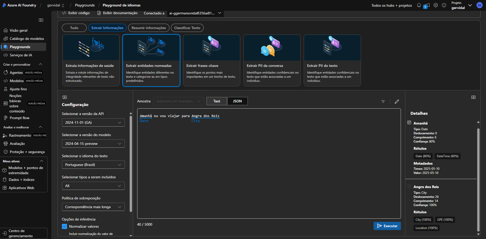
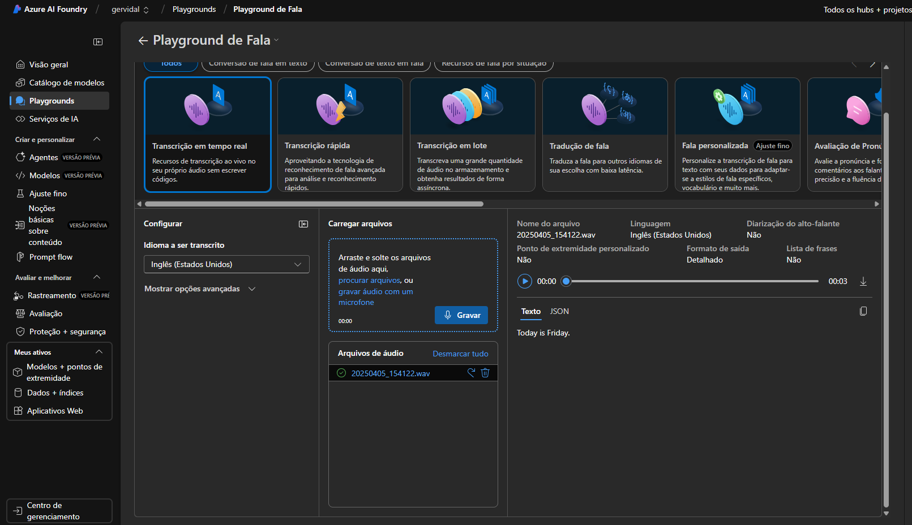
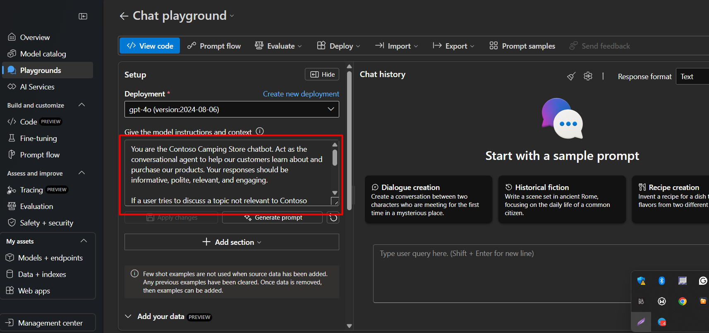

# Analise de Sentimentos com Language Studio no Azure AI

### A plataforma Azure AI possui diversas ferramentas valiosas, abaixo citarei algumas das quais tive contato durante o curso.

- Na ferramenta de análise de texto a inteligência artificial identifica caracteristicas da ortografia da frase.

- Na ferramenta Estudio de Fala a inteligência artifial transcreve a fala em tempo real. Esse tipo de transcrição é visto em videos no YouTube, por exemplo.

- No serviço de bot da Azure, a pessoa desenvolvedora pode descrever á inteligência artificial quais caracteristicas ela deseja que seu Chatbot possua.

Em resumo afirmo que a Azure AI é ferramenta poderosa para aplicar IA em áreas como atendimento ao cliente, automação de processos e análise de conteúdo textual facilitando serviços como:

- Analisar sentimentos e opiniões em textos.

- Reconhecer entidades nomeadas (como nomes de pessoas, locais ou organizações).

- Classificar textos por categorias.

- Extrair informações importantes de documentos.

- Criar bots e assistentes virtuais inteligentes com compreensão de linguagem natural