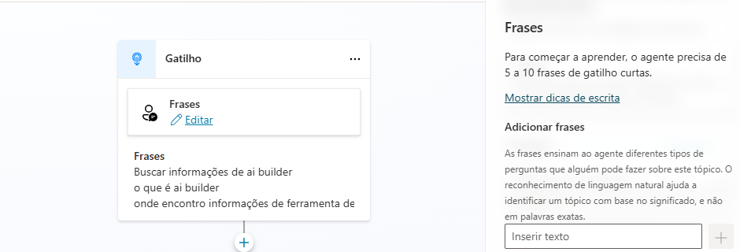
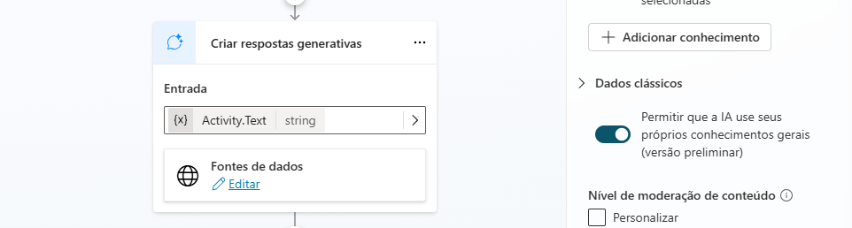
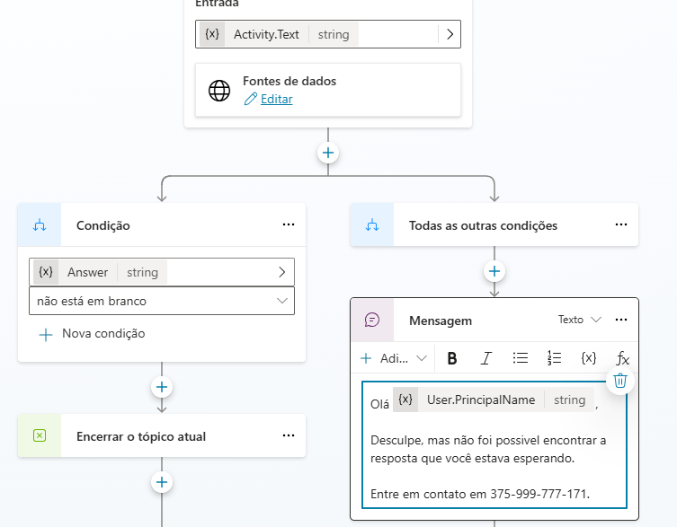

# Microsoft Copilot Studio

Neste módulo aprendi a criar e gerenciar tópicos e variáveis de forma que as respostas dadas ao usuário sejam mais corretas, além disso aprendi a adicionar IA generativa para auxiliar nas respostas.

#### Customização de Tópicos

O print acima mostra a customização que fiz no tópico de frases exibidas.

#### Customização do Tópico de resposta da IA Generativa

O print acima mostra a personalização da IA Generativa.

#### Customização do Tópico da mensagem de erro.

O print acima mostra a customização que fiz na mensagem de erro.

A prática fez com que eu entendesse melhor o conteúdo ensinado e desenvolvesse melhor hábilidade na plataforma.