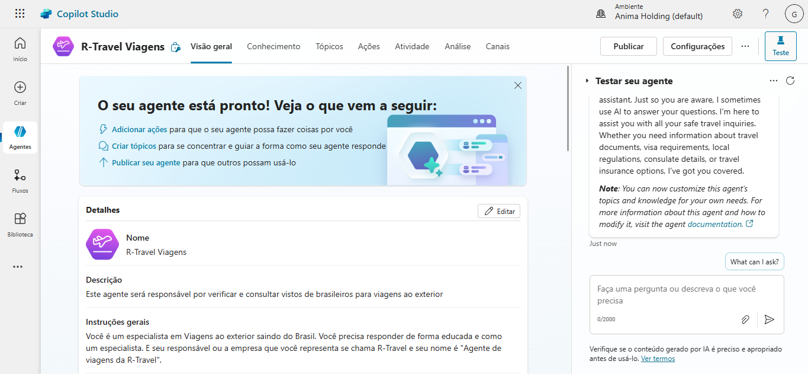

# Microsoft Copilot Studio

Neste módulo fui apresentado a esta ferramenta chamada Copilot Studio que resumidamente consiste em uma plataforma que funciona como uma oficina em que podemos criar, personalizar e treinar assistentes IA para usar em aplicações diversas. 

#### Criação de Copilot baseado em Modelo

Utilizando um dos modelos fornecisos pela plataforma.

#### Criação de Copilot baseado com descrição em IA

Utilizando IA integrada a plataforma, descrevi o que eu desejo e o arquivo foi gerado de acordo com a descrição.

#### Criação de Copilot em Branco

Utilizando o preenchimento dos campos disponíveis na plataforma.

É importante destacar que foram criados em ambientes diferentes, afetando todo o controle que exerço. Confesso que achei que se tratava de uma outra IA generativa como ChatGPT e DeepSeak, e fui positivamente surpreendido ao descobrir uma ferramenta diferente que com certeza ajudará meu proseguimento na carreira.